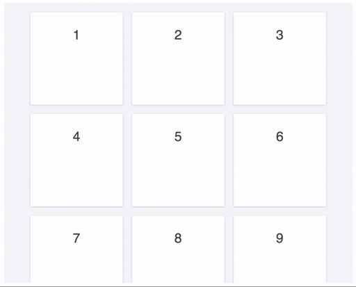
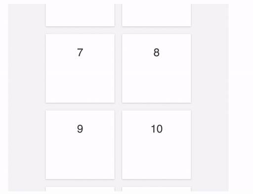
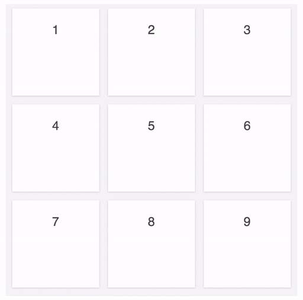
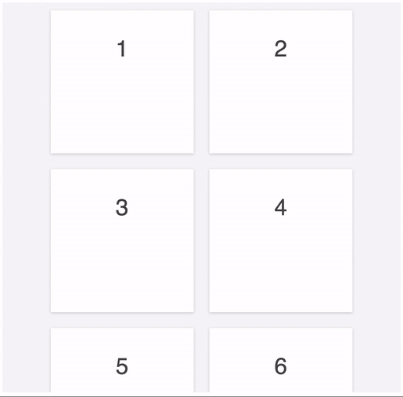

# collection-view

[](https://travis-ci.org/turbolent/collection-view)

A container for displaying large ordered collections of data items and presenting them using arbitrary layouts (e.g. lists, grids). Large collections can be scrolled smoothly by displaying only a limited number of elements. This is also known as "windowing" or "virtualization". [Changes to the data](#changing-the-data) (remove, add, move) and [changes to the layout](#changing-the-layout) are properly animated by the collection view. The library is inspired by [iOS' UICollectionView](https://developer.apple.com/documentation/uikit/uicollectionview) and [Android's RecyclerView](https://developer.android.com/guide/topics/ui/layout/recyclerview.html).

The collection view gets its data from a [delegate](#delegate) and gets its visual information from a layout. Currently there is a [grid layout](#grid-layout), which presents the collection in rows and columns, and a simple [list layout](#list-layout), which presents the collection in rows. [Custom layouts](#custom-layout) can be implemented easily. Contributions are welcome!



The collection view also handles resizing of the container properly, maintaining the current position in the collection.




## Usage

```js
import { CollectionView, GridLayout } from 'collection-view'

class Delegate {
  constructor(items) {
    this.items = items
  }

  getCount() {
    return this.items.length
  }

  configureElement(element, index) {
    element.textContent = this.items[index]
  }
}

let items = ["Item 1", "Item 2", "Item 3", "Item 4", "Item 5", "Item 6", "Item 7", "Item 8", "Item 9", "Item 10"]
let delegate = new Delegate(items)
let layout = new GridLayout()
let contentElement = document.getElementById('content')
let view = new CollectionView(contentElement, layout, delegate)
```

Implement a [delegate](#delegate) for your collection. Instantiate a layout, like a [grid](#grid-layout) or [list](#list-layout), and configure it. Finally, instantiate a collection view, providing the DOM element which should contain the elements representing the items in the collection, the layout, and the delegate.

If the grid or list layouts do not fit your needs you can also [implement a custom layout](#custom-layout).


## Delegate

The delegate object is responsible for defining how many items the collection view should display and configuring the elements  corresponding to the items.

- **getCount(): _number_** (required)

  Return the number of items in the collection.

  Similar to [`UICollectionViewDataSource.collectionView(_:numberOfItemsInSection:)`](https://developer.apple.com/documentation/uikit/uicollectionviewdatasource/1618058-collectionview)

- **configureElement(element: _HTMLElement_, index: _number_)** (required)

  Configure the DOM element that corresponds to the item in the collection at the given index. The element might have previously been used to represent another item in the collection, so ensure to properly restore it to its initial state. If this method registers events, implement `invalidateElement` (see below) and make sure to unregister them there.

  Similar to [`UICollectionViewDataSource.collectionView(_:cellForItemAtIndexPath:)`](https://developer.apple.com/documentation/uikit/uicollectionviewdatasource/1618029-collectionview)

- **invalidateElement(element: _HTMLElement_, index: _number_)** (optional)

  Called when an element no longer displays the item at the given index. Implement this method to e.g. unregister events.

- **onScroll(view: _CollectionView_)** (optional)

  Called when the collection view is scrolled.

  Similar to [`UIScrollViewDelegate.scrollViewDidScroll(_:)`](https://developer.apple.com/documentation/uikit/uiscrollviewdelegate/1619392-scrollviewdidscroll)

- **getStyle(index: _number_, phase: _CollectionViewAnimationPhase_, info, position: _Position_): _Style_** (optional)

  Called to determine the style of the element at the given index for the given animation phase and position.
  The returned style is an object with hyphen-style CSS properties and string values, e.g. `{"background-color": "red"}`.

  See below for the `info` parameter.

  - **phase: _CollectionViewAnimationPhase_**

    - `ELEMENT_APPEARING`: The element is about to appear ("is entering")
    - `ELEMENT_APPEARED`: The element has appeared
    - `ELEMENT_DISAPPEARED`: The element has disappeared ("has left")

- **getAnimationDuration(index: _number_, info, property: _string_, reason: _CollectionViewAnimationReason_): _number_** (optional)

  Return the animation duration for the given property for element at the given index.

  See below for the `info` and `reason` parameters.

- **getAnimationDelay(index: _number_, info, property: _string_, reason: _CollectionViewAnimationReason_): _number_** (optional)

  Return the animation duration for the given property for element at the given index.

  See below for the `info` and `reason` parameters.


The `getAnimationDuration` and `getAnimationDelay` delegate methods are passed a `reason` parameter, which indicates why the element is animated.

- **reason: _CollectionViewAnimationReason_**

  - `ELEMENT_ADDITION`: The element is being added
  - `ELEMENT_REMOVAL`: The element is being removed
  - `ELEMENT_MOVE`: The element is being repositioned
  - `LAYOUT_UPDATE`: The layout is updated. This is also the case when the collection view is being resized.

The `getStyle`, `getAnimationDuration`, and `getAnimationDelay` delegate methods are also passed an `info` parameter, which is layout information for the element, provided by the current layout.
When a list layout is used, it is an object with a `row` property, and when a grid layout layout is used, it is an object containing `row` and `column` properties.


## Changing the data

The collection view supports transitions between different collections. As it is not aware of the underlying data itself, the changes have to be provided to the collection view explicitly, in the form of the indices of the items which were removed, added, and moved, passed to the method:

**changeIndices(removed: _number[]_, added: _number[]_, moved: _Map.<number, number>_): Promise**

* **removed: _number[]_**

  Indices which were removed, referring to the collection before the changes

* **added: _number[]_**

  Indices which were added, referring to the collection after the changes

* **moved: _Map.<number, number>_**

  Indices which were moved. The keys are indices referring to the collection before the changes, and the values are indices referring to the collection after the changes.

  May also be passed as an _Object.<string, number>_



For example, when transitioning from the original collection [1, 2, 3, 4, 5, 6, 7, 8, 9, 10, 11] to the target collection [1, 15, 16, 3, 6, 8, 4, 10, 11]:

* The items at indices [1, 4, 6, 8] in the original collection are not in the target collection anymore (**removed**):

  [1, **2**, 3, 4, **5**, 6, **7**, 8, **9**, 10, 11]

* The items at indices [1, 2] in the target collection are new in the target collection (**added**):

  [1, **15**, **16**, 3, 6, 8, 4, 10, 11]

* The item at index 3 in the original collection is now at index 6 in the target collection (**moved**):

  [1, 2, 3, **4**, 5, 6, 7, 8, 9, 10, 11]

  [1, 15, 16, 3, 6, 8, **4**, 10, 11]

Therefore, the method call would be `changeIndices([1, 4, 6, 8], [1, 2], new Map([[3, 6]]))` (or alternatively `changeIndices([1, 4, 6, 8], [1, 2], new Map([3, 6]))` for older environments).

Similar to calling [`UICollectionView.deleteItems(at:)`](https://developer.apple.com/documentation/uikit/uicollectionview/1618060-deleteitems), [`UICollectionView.insertItems(at:)`](https://developer.apple.com/documentation/uikit/uicollectionview/1618097-insertitems), and multiple [`UICollectionView.moveItem(at:to:)`](https://developer.apple.com/documentation/uikit/uicollectionview/1618059-moveitem) as part of a call to [`performBatchUpdates(_:completion:)`](https://developer.apple.com/documentation/uikit/uicollectionview/1618045-performbatchupdates)


## Grid layout

The `GridLayout` displays collection items in a grid. All items are the same size and flow from
one row or column (depending on the direction) to the next.

It is similar to [`UICollectionViewFlowLayout`](https://developer.apple.com/library/ios/documentation/UIKit/Reference/UICollectionViewFlowLayout_class/).


* **direction: _Direction_**

  The direction in which the collection view scrolls.

  If `Direction.VERTICAL`, the collection view scrolls vertically and items flow in rows from left to right.

  If `Direction.HORIZONTAL`, the collection view scrolls horizontally and items flow in columns from top to bottom.

  Default: `Direction.VERTICAL`

  Similar to [`UICollectionViewFlowLayout.scrollDirection`](https://developer.apple.com/documentation/uikit/uicollectionviewflowlayout/1617720-scrolldirection)


* **itemSize: _Size_**

  The size (width and height) of each item.

  Default: `new Size(200, 200)`

  Similar to [`UICollectionViewFlowLayout.itemSize`](https://developer.apple.com/documentation/uikit/uicollectionviewflowlayout/1617711-itemsize)


* **spacing: _Spacing_**

  The spacing (horizontal and vertical) between the items.

  Default: `new Spacing(20, 20)`

  Similar to [`UICollectionViewFlowLayout.minimumInteritemSpacing`](https://developer.apple.com/documentation/uikit/uicollectionviewflowlayout/1617706-minimuminteritemspacing) and [`UICollectionViewFlowLayout.minimumLineSpacing`](https://developer.apple.com/documentation/uikit/uicollectionviewflowlayout/1617717-minimumlinespacing)


* **insets: _Insets_**

  The insets (padding) of the whole content: top, bottom, left, right.

  Default: `new Insets(10, 10, 10, 10)`

  Similar to [`UICollectionViewFlowLayout.sectionInset`](https://developer.apple.com/documentation/uikit/uicollectionviewflowlayout/1617714-sectioninset)


## List layout

The `ListLayout` displays collection items in a list. All items have the same height.

* **rowHeight: _number_**

  The height of each row.

  Default: `200`


## Changing the layout

The collection view supports transitions between different layouts. Simply instantiate a new layout, configure it, and call:

**updateLayout(newLayout: _CollectionViewLayout_): Promise**

For example, this allows changing the item size or direction of a [grid layout](#grid-layout). The collection view properly maintains the position in the collection.




## Custom layout

The layout object is responsible for defining the size of the collection view content element and positions of the elements representing the items of the collection. Normally it is not necessary to implement a custom layout, as the [grid](#grid-layout) and [list layout](#list-layout) should be sufficient in most use-cases. Still, if another layout is desired, the following methods need to be implemented:

- **getContentSize(count: _number_, containerSize: _Size_): _Size_** (required)

  Return the width and height of the whole content, i.e. the space that all elements occupy, not just the content that is currently visible.

  Similar to [`UICollectionViewLayout.collectionViewContentSize`](https://developer.apple.com/documentation/uikit/uicollectionviewlayout/1617796-collectionviewcontentsize)

- **updateContainerSize(containerSize: _Size_)** (optional)

  Informs the layout about the new size of the container. Might be used to recalculate positioning information.

- **getIndices(ranges: _Ranges_, count: _number_, containerSize: _Size_): _number[]_** (required)

  Return an array of the visible indices in the region (given by ranges). The given container size might be different from the container size provided to `updateContainerSize` if the collection view is updated to another layout.

  Similar to [`UICollectionViewLayout.layoutAttributesForElements(in:)`](https://developer.apple.com/documentation/uikit/uicollectionviewlayout/1617769-layoutattributesforelements)

- **getElementPosition(index: _number_): _Position_** (required)

  Return the top-left position of the element representing the item at the specified index in the collection.

  Similar to [`UICollectionViewLayout.layoutAttributesForItem(at:)`](https://developer.apple.com/documentation/uikit/uicollectionviewlayout/1617797-layoutattributesforitem)

- **configureElement(element: _HTMLElement_, index: _number_)** (required)

  Apply visual details to the element, e.g. set the size.

- **convertPositionInSize(position: _Position_, newContainerSize: _Size_, oldLayout: _CollectionViewLayout_): _Position_** (required)

  Calculate the new scroll position for the given current scroll position in the given layout. The old layout may be of another type. Used to maintain the current scroll position in the collection view when it is transitioning to another layout and when the collection view is resizing.


## Collection view

* **contentSize: _Size_**

  The size of the scrolled content. Computed by the layout based on the data returned from the delegate.

  Similar to [`UIScrollView.contentSize`](https://developer.apple.com/documentation/uikit/uiscrollview/1619399-contentsize)

* **containerSize: _Size_**

  The size of the container wrapping the scrolled content, i.e. the size of the content that is actually displayed, a region of `contentSize`.

* **scrollPosition: _Position_**

  The point at which the origin of the content is offset from the origin of the collection view.

  Similar to [`UIScrollView.contentOffset`](https://developer.apple.com/documentation/uikit/uiscrollview/1619404-contentoffset)

* **thresholds: _object_**

  Specifies the additional values by which the region is extended that is used to determine the visible elements. Increasing the values leads to more elements staying attached to the scroll element. This improves appearance, as elements are already properly positioned and configured when they are becoming visible to the user. However, it is also likely to reduce scroll performance, as more elements need to be rendered by the browser.

  Keys: `left`, `top`, `right`, and `bottom`.

  Default: all values are `CollectionView.DEFAULT_THRESHOLD` = `3000`

* **animationDuration: _number_**

  Specifies how long animations take by default. Animations durations for each element can also be provided through the delegate method `getAnimationDuration`.

  Default: `CollectionView.DEFAULT_ANIMATION_DURATION` = `400`


## Examples

The `examples` directory contains several examples demonstrating the features of the collection view. To try them out, go to each subdirectory, run `webpack` and open the `index.html`.

## React

For usage with React, see `examples/react`.
